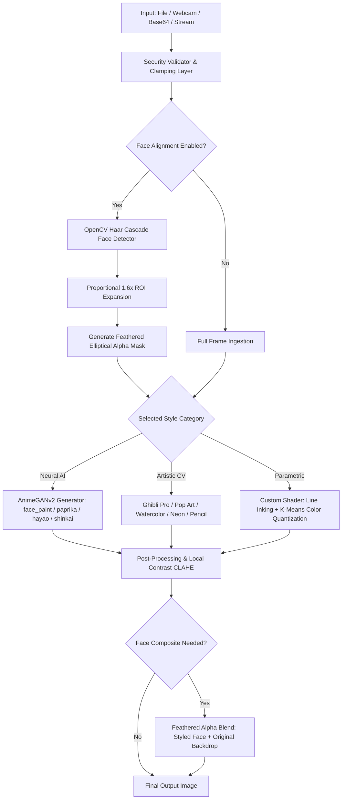

<div align="center">

# 🎨 Cartoonify Studio Pro
### Enterprise AI & Computer Vision Image Cartoonization Suite

[](https://aryanxcode646.github.io/cartoon-image-generator67/)
[](tests/test_security.py)
[](https://www.python.org/)
[](https://fastapi.tiangolo.com/)
[](https://pytorch.org/)
[](https://opencv.org/)
[](Dockerfile)
[](LICENSE)

<p align="center">
  Transform ordinary photos, portraits, and landscapes into stunning anime, Studio Ghibli, pop-art comic, and watercolor artwork. Features an ultra-modern <strong>Web Studio</strong> with an interactive Before/After split slider, a sleek <strong>Desktop GUI</strong>, a developer-first <strong>CLI & Python SDK</strong>, and a static <strong>Showcase Landing Page</strong>.
</p>

[**🌐 Live Showcase Website**](https://aryanxcode646.github.io/cartoon-image-generator67/) • [**✨ Web Studio**](#-1-launch-the-web-studio) • [**🖥️ Desktop GUI**](#-2-launch-the-desktop-gui) • [**⚡ Python SDK**](#-4-python-sdk-integration) • [**🛡️ Security Matrix**](#-enterprise-security-hardening--fuzz-testing)

</div>

---

## 🌟 12 Curated Visual Styles

| Style | Category | Description | Accent |
| :--- | :---: | :--- | :---: |
| **🎬 Studio Ghibli Pro** | *Artistic CV* | Lush hand-painted animation aesthetic with warm color harmonies and soft atmospheric lighting. | `#FF6B6B` |
| **✨ Anime Portrait Soft** | *Neural AI* | State-of-the-art neural anime stylization with expressive eyes and crisp face preservation. | `#4ECDC4` |
| **🎨 Paprika Vibrant** | *Neural AI* | Warm saturated cinematic cartoon look inspired by Satoshi Kon feature animation. | `#FFB84D` |
| **🍃 Hayao Anime** | *Neural AI* | Miyazaki-inspired vivid green fields, brilliant blue skies, and cinematic lighting. | `#2ECC71` |
| **🌌 Shinkai Luminous** | *Neural AI* | Makoto Shinkai high-contrast radiant lighting and glowing atmospheric accents. | `#9B59B6` |
| **💥 Comic Pop Art** | *Artistic CV* | Bold graphic novel inked contours with vibrant cell-shaded primary colors. | `#E74C3C` |
| **🎭 Watercolor Dream** | *Artistic CV* | Soft pigment diffusion, gentle paper texture wash, and fluid color bleeding. | `#A8D8EA` |
| **✏️ Pencil & Charcoal** | *Artistic CV* | Detailed graphite crosshatch line work with smooth continuous shading. | `#95A5A6` |
| **🖍️ Colored Pencil** | *Artistic CV* | Hand-drawn color sketch with textured paper grain and vibrant strokes. | `#F39C12` |
| **⚡ Neon Cyberpunk** | *Artistic CV* | Darkened cinematic scene with electric cyan and magenta glowing edges. | `#00F0FF` |
| **📺 Retro 90s TV Toon** | *Artistic CV* | Nostalgic Saturday morning cartoon aesthetic with thick black ink borders. | `#FD79A8` |
| **🎛️ Custom Pro Shader** | *Parametric* | Real-time tunable parameters: line thickness, opacity, color count, saturation, and contrast. | `#00CEC9` |

---

## 🚀 Key Features

- **🌐 Modern Web Studio**: Glassmorphism UI with interactive drag-and-drop, real-time Before/After comparison slider, live camera snapshot, and responsive dark/light themes.
- **✨ GitHub Pages Showcase (`docs/`)**: Zero-dependency static landing page with an in-browser live HTML5 Canvas cartoon simulator.
- **🖥️ Desktop GUI**: Cross-platform responsive desktop app with side-by-side comparison, non-blocking asynchronous processing threads, and history gallery.
- **⚡ Neural & CV Engine**: Combines deep learning (PyTorch Hub AnimeGANv2) and high-performance OpenCV algorithms for instant, offline-capable rendering.
- **👤 Face-Preserved Alignment**: Smart face detection with elliptical feathered alpha masking to preserve identity on portrait photos.
- **📦 Batch Processing**: Convert entire image directories in seconds and export directly as a ZIP archive.
- **🛡️ 50/50 Security & Fuzz Tests**: Protected against decompression bombs, path traversal, Zip Slip, and NaN/Inf boundary vectors.
- **🐳 Docker Ready**: Containerized deployment via Dockerfile and Docker Compose.

---

## 🔬 Algorithmic Blueprint & Math Models



### 1. Multi-Pass Bilateral Color Smoothing (Studio Ghibli Pro)
Smooths flat surfaces while preserving sharp edge boundaries:
$$I_{\text{smooth}}(x) = \frac{1}{W_p} \sum_{x_i \in \Omega} I(x_i) \cdot g_s(\|x_i - x\|) \cdot g_r(\|I(x_i) - I(x)\|)$$

### 2. Feathered Gaussian Alpha Mask (Face Preservation)
Calculates a 1.6x expanded centroid bounding box around detected facial coordinates and applies a continuous Gaussian fade to eliminate square seams:
$$\alpha(x, y) = \exp\left(-\left(\frac{(x - c_x)^2}{2\sigma_x^2} + \frac{(y - c_y)^2}{2\sigma_y^2}\right)\right)$$

### 3. Color Dodge Sketch Blending (Pencil & Charcoal)
$$I_{\text{sketch}}(x, y) = \min\left(255, \frac{I_{\text{gray}}(x, y) \cdot 256}{255 - I_{\text{inv\_blur}}(x, y) + 1}\right)$$

### 4. K-Means Cell Quantization (Comic Pop Art)
$$\arg\min_{\mu} \sum_{i=1}^{N} \min_{k} \|x_i - \mu_k\|^2$$

---

## 🛡️ Enterprise Security Hardening & Fuzz Testing

The codebase includes an enterprise security test suite in `tests/test_security.py`:

| Protection Layer | Security Invariant | Status |
| :--- | :--- | :---: |
| **Pixel Decompression Bomb** | Pillow 50M limit + 40MP max dimension rejection | ✅ PASSED |
| **Path Traversal Defense** | Strips `../../`, `..\Windows`, null bytes `\x00`, special characters | ✅ PASSED |
| **Zip Slip & Zip Bomb** | Capped at 50 files / 200MB uncompressed buffer | ✅ PASSED |
| **Adversarial Fuzzing** | Handles `NaN`, `+Infinity`, `-Infinity`, negative slider values | ✅ PASSED |
| **Corrupted Stream Resilience** | Handles mutated bit-flipped byte streams and invalid Base64 | ✅ PASSED |
| **HTTP Security Headers** | `X-Content-Type-Options: nosniff`, `X-Frame-Options: SAMEORIGIN` | ✅ PASSED |
| **Thread Safety** | Mutex-guarded neural model cache with zero race conditions | ✅ PASSED |

```bash
# Run the complete test suite:
pytest tests/ -v
# ===================== 50 passed in 56.43s =====================
```

---

## 🛠️ Quick Installation

### 1. Clone the Repository
```bash
git clone https://github.com/AryanXCode646/cartoon-image-generator67.git
cd cartoon-image-generator67
```

### 2. Create & Activate Virtual Environment
```bash
python -m venv .venv

# Windows (PowerShell)
.\.venv\Scripts\Activate.ps1

# Linux / macOS
source .venv/bin/activate
```

### 3. Install Dependencies
```bash
pip install -r requirements.txt
# Or install in editable developer mode:
pip install -e .
```

---

## 🎯 How to Run

### 🌐 1. Launch the Web Studio (Recommended)
```bash
# Windows 1-click launcher:
run_web.bat

# Or via CLI:
python -m cartoonify web
```
Then open your browser at **`http://127.0.0.1:8000`**.

---

### 🖥️ 2. Launch the Desktop GUI
```bash
# Windows 1-click launcher:
run_gui.bat

# Or via CLI:
python -m cartoonify gui
```

---

### 💻 3. Command-Line Interface (CLI)

#### Process a single image:
```bash
python -m cartoonify process samples/sample_portrait.jpg -o output_ghibli.jpg --style ghibli_pro --strength 0.85
```

#### Process with face-aligned preservation:
```bash
python -m cartoonify process selfie.jpg -o selfie_anime.jpg --style anime_soft --face-align
```

#### Batch process an entire directory:
```bash
python -m cartoonify batch ./my_vacation_photos -o ./cartoons --style comic_pop
```

#### List all available styles:
```bash
python -m cartoonify list-styles
```

---

### 🐍 4. Python SDK Integration

```python
from cartoonify import CartoonEngine
import cv2

# Initialize the engine (auto-selects CUDA GPU or CPU)
engine = CartoonEngine()

# 1. Process image file with face alignment
engine.process_file(
    "samples/sample_portrait.jpg",
    "cartoon_portrait.jpg",
    style="ghibli_pro",
    strength=0.85,
    use_face_align=True
)

# 2. In-memory matrix processing with custom parametric shader
img = cv2.imread("samples/sample_landscape.jpg")
cartoon = engine.process_image(
    img,
    style="custom",
    custom_params={
        "line_thickness": 2,
        "line_opacity": 0.8,
        "num_colors": 12,
        "saturation": 1.3
    }
)
cv2.imwrite("custom_landscape.jpg", cartoon)
```

---

### 🐳 5. Docker Deployment

```bash
# Start Web Studio in container:
docker-compose up -d

# Open in browser:
http://localhost:8000
```

---

### ⚡ Windows 1-Click Launchers

| Launcher Script | Description |
| :--- | :--- |
| **`run_web.bat`** | Launches FastAPI server & opens Web Studio in default browser |
| **`run_gui.bat`** | Launches the modern Tkinter Desktop GUI |
| **`run_cli.bat`** | Opens interactive CLI helper |
| **`run_tests.bat`** | Executes the 50/50 Pytest suite |
| **`run_showcase_website.bat`** | Opens the static showcase website locally |

---

## 🧪 Testing & CI/CD

```bash
# Run all 50 unit and security tests:
pytest tests/ -v

# Run with coverage:
pytest --cov=cartoonify tests/
```

Automated GitHub Actions CI runs on every push across **Ubuntu (Linux)**, **Windows**, and **macOS**.

---

## 📄 License

Distributed under the **MIT License**. See [`LICENSE`](LICENSE) for more details.

---

<div align="center">
  Built with ❤️ by Aryan • Open Source AI & Computer Vision
</div>
